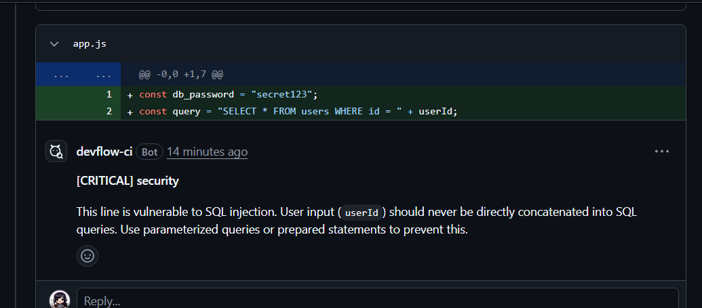

# DevFlow CI

> Automated AI code reviewer that catches security vulnerabilities, bugs, and style issues — posting inline GitHub PR comments in under 60 seconds.


## 🎯 Demo

> 🚧 Live demo -https://devflow-ci-dashboard.onrender.com.


*DevFlow CI bot catching a SQL injection vulnerability inline on a GitHub PR*

## 📑 Table of Contents

- [Features](#-features)
- [Tech Stack](#-tech-stack)
- [Architecture](#-architecture)
- [Getting Started](#-getting-started)
- [Environment Variables](#-environment-variables)
- [How It Works](#-how-it-works)
- [Security & Privacy](#-security--privacy)
- [Project Structure](#-project-structure)
- [Roadmap](#-roadmap)

## ✨ Features

- 🤖 **AI-powered code reviews** using Gemini 2.5 Flash — catches SQL injection, hardcoded secrets, unhandled promises, and performance issues that slip through manual review
- 💬 **Inline PR comments** on specific files and line numbers — feedback appears directly on the relevant line, not as a wall of text
- 🔒 **Posts as a GitHub App bot** (not your personal account)
- 📊 **Dashboard** to track all reviews, stats, and repo connections
- 🔐 **GitHub OAuth authentication**
- 🛡️ **Security**: HMAC webhook validation, AES-256 token encryption, rate limiting, helmet.js
- 🗄️ **Full persistence** with PostgreSQL via Prisma
- ⚡ **Async processing** with BullMQ + Redis — handles traffic spikes without dropping webhook events
- 🔏 **Privacy**: consent banner, account deletion, Gemini data opt-out

## 🛠️ Tech Stack

| Backend | Frontend |
|---|---|
| Node.js + TypeScript | React + TypeScript |
| Express.js | Vite |
| BullMQ + Redis | Tailwind CSS |
| PostgreSQL + Prisma | React Router v6 |
| Google Gemini AI | Axios |
| GitHub App SDK | Shadcn/ui components |
| JWT + HttpOnly cookies | |

## 🏗️ Architecture

```text
GitHub PR Opened
    │
    ▼
Webhook (HMAC verified)
    │
    ▼
BullMQ Queue (Redis)
    │
    ▼
Worker picks up job
    │
    ▼
Fetch diff from GitHub API
    │
    ▼
Filter files (skip node_modules, >50KB)
    │
    ▼
Send to Gemini AI (structured JSON output)
    │
    ▼
Parse inline comments
    │
    ▼
Post via GitHub App bot
    │
    ▼
Save to PostgreSQL
    │
    ▼
Dashboard updates
```

## 🚀 Getting Started

### Prerequisites
- Node.js (v18+)
- PostgreSQL database
- Redis server
- GitHub App & OAuth App setup
- Google Gemini API Key

### Installation

1. **Clone the repository**
   ```bash
   git clone https://github.com/bandnikita1728/devflow-ci.git
   cd devflow-ci
   ```

2. **Install dependencies**
   ```bash
   npm install
   cd apps/dashboard && npm install
   cd ../..
   ```

3. **Environment Setup**
   ```bash
   cp .env.example .env
   # Edit .env with your credentials
   ```

4. **Database Migration**
   ```bash
   npx prisma migrate dev
   ```

5. **Start the services**

   Start the API Gateway:
   ```bash
   npm run dev
   ```

   Start the Background Worker:
   ```bash
   npm run dev:worker
   ```

   Start the Frontend Dashboard:
   ```bash
   cd apps/dashboard
   npm run dev
   ```

## ⚙️ Environment Variables

| Variable | Description |
|---|---|
| `PORT` | API gateway port (default: 3001) |
| `DATABASE_URL` | PostgreSQL connection string |
| `REDIS_URL` | Redis connection string |
| `GITHUB_CLIENT_ID` | GitHub OAuth App Client ID |
| `GITHUB_CLIENT_SECRET` | GitHub OAuth App Client Secret |
| `GITHUB_SECRET` | Webhook signature secret |
| `GITHUB_APP_ID` | GitHub App ID |
| `GITHUB_APP_PRIVATE_KEY_PATH`| Path to GitHub App `.pem` key |
| `JWT_SECRET` | Secret key for JWT signing |
| `TOKEN_ENCRYPTION_KEY` | AES-256 key for encrypting GitHub tokens |
| `GEMINI_API_KEY` | Google Gemini AI API key |
| `WEBHOOK_URL` | Your public webhook URL (e.g. ngrok) |
| `FRONTEND_URL` | URL of the frontend dashboard |

## 🧠 How It Works

- **Webhook Handler**: The API gateway listens for incoming GitHub `pull_request` events, verifies the HMAC payload signature, and pushes the event to a Redis queue.
- **Queue**: BullMQ acts as the message broker, safely queuing up PR review jobs to handle traffic spikes.
- **Worker**: An isolated background Node.js process picks up jobs, fetches the raw code diff via the Octokit GitHub App SDK, filters out noise, and queries the AI.
- **AI Service**: Gemini 2.5 Flash analyzes the filtered diff, returning a strict JSON array of specific line numbers and code feedback. The worker parses this array and posts it as inline comments directly to the GitHub PR.

## 🛡️ Security & Privacy

We take data security seriously:
- **AES-256 Encryption**: Your GitHub OAuth tokens are heavily encrypted at rest in the database.
- **Zero AI Training**: We explicitly instruct the Gemini model to discard and never train on your proprietary code.
- **HMAC Verification**: Webhooks are cryptographically signed and verified to ensure they legitimately originated from GitHub.
- **Rate Limiting**: The API is protected against brute force and DDoS attacks via `express-rate-limit`.
- **Full Deletion**: A unified "Danger Zone" account deletion route instantly cascades and purges all of your data, repositories, and reviews.

## 📁 Project Structure

```text
devflow_ci/
├── apps/
│   ├── api-gateway/     # Express backend
│   ├── worker/          # BullMQ worker
│   └── dashboard/       # React frontend
├── prisma/              # Database schema & migrations
├── render.yaml          # Render deployment config
└── docker-compose.yml   # Local Docker setup
```

## 🗺️ Roadmap

- [ ] Deploy to Render (in progress)
- [ ] OpenAI and Claude model support alongside Gemini
- [ ] Webhook retry logic with exponential backoff
- [ ] Email notifications on review completion
- [ ] Custom review rules per repository
- [ ] Review analytics dashboard (trends, severity over time)
- [ ] Multi-org support

## 🤝 Contributing

Pull requests are welcome. For major changes, please open an issue first to discuss what you would like to change.

## 📄 License

[MIT](LICENSE)
